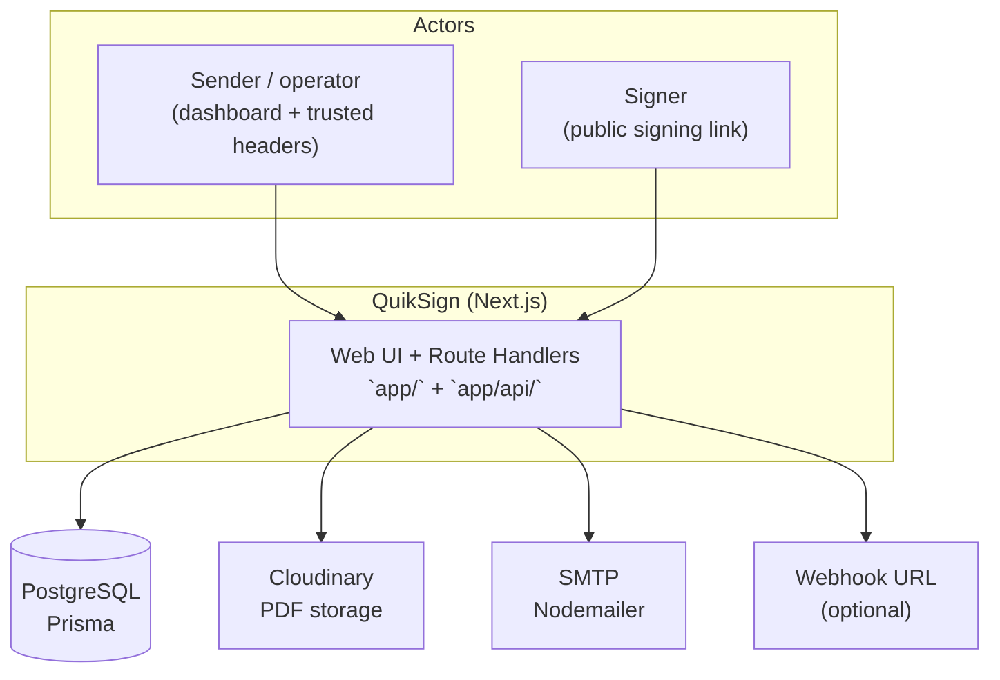
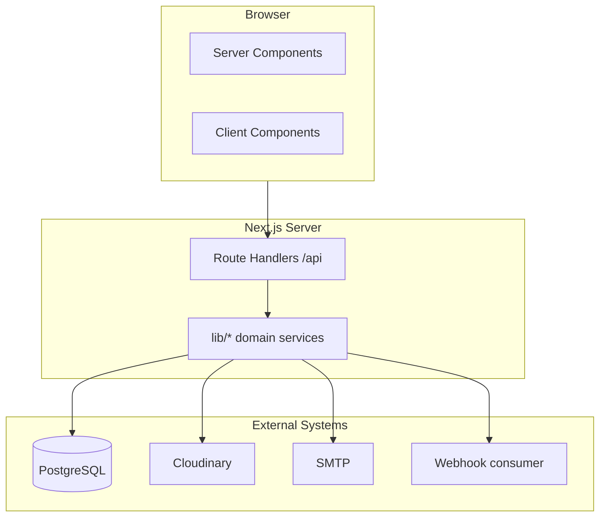
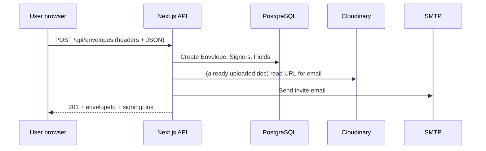
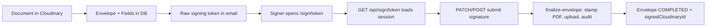
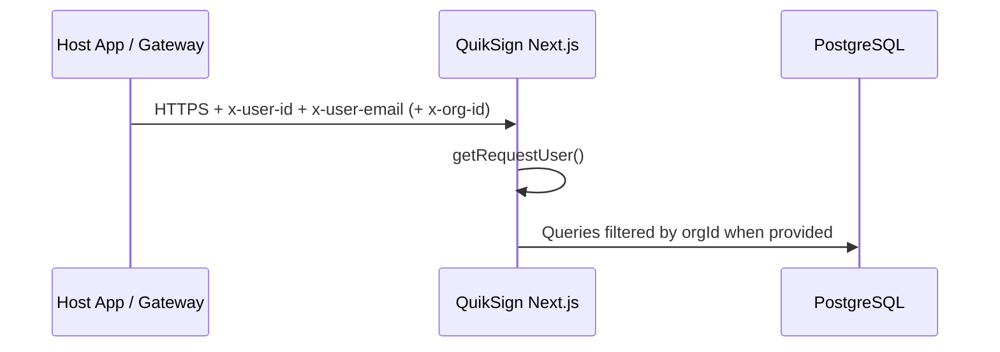
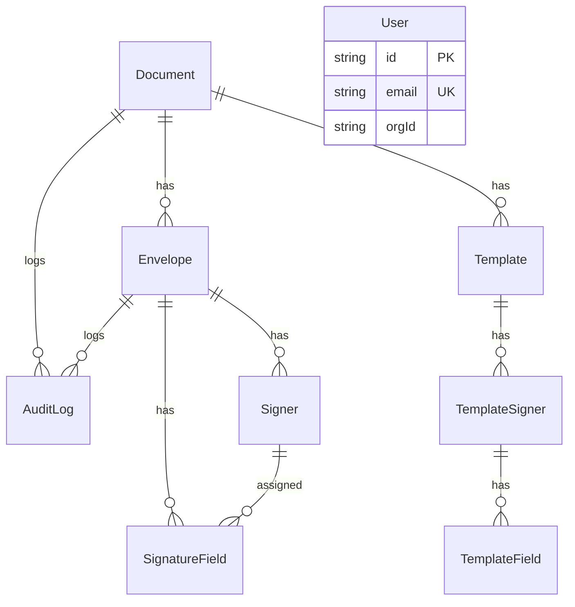
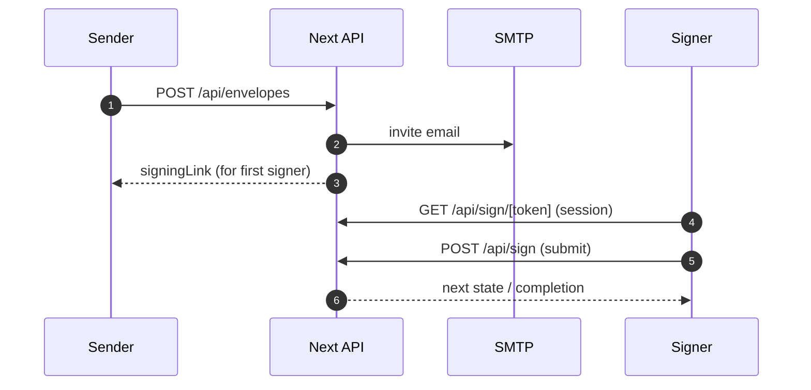
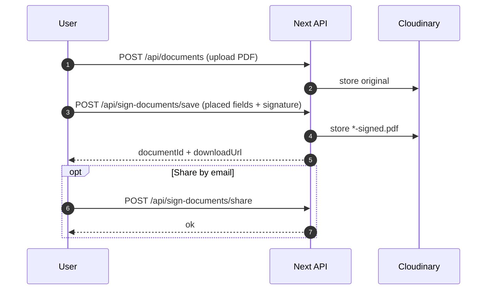
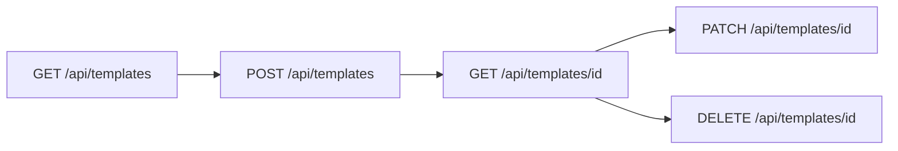
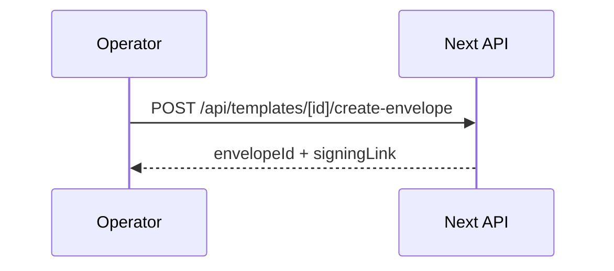

# COMPLETE PROJECT DOCUMENTATION

**Product:** QuikSign  
**Repository:** `quiksign` (private Next.js application)  
**Document version:** 1.3 (generated from source analysis, May 2026)  
**Scope:** This document reflects the **actual** implementation in the repository at documentation time. Where behavior depends on deployment (e.g. Vercel vs self-hosted), assumptions are called out explicitly.

**Full catalogs (add-all appendices):** **Appendix B** (every Zod schema), **Appendix C** (every Prisma column + enum), **Appendix D** (every `lib/` file), **Appendix E** (every `components/` file), **Appendix F** (every test), **Appendix G** (scripts + root configs), **Appendix H** (app shell files). **Appendix A** + **§8.0** list every API handler. **Appendix J** documents **every handler’s request/response** with **concrete JSON examples** where applicable (v1.3 completed remaining POST/GET samples).

---

# 1. PROJECT OVERVIEW

## 1.1 Project Name

**QuikSign** — an agreement lifecycle and e-signature service built as a full-stack Next.js application.

## 1.2 Project Purpose

QuikSign enables organizations to:

- Store PDF (and optionally Word) documents in cloud object storage with time-limited signed access URLs.
- Define **envelopes**: a document plus ordered recipients (**signers** / **CC**), placement of **signature fields** on specific PDF pages, and lifecycle state (draft → sent → completed / voided / declined / expired).
- **Send** signing invitations over **SMTP** with a unique **public signing link** (`/sign/[token]`).
- Let signers complete fields in the browser; the system stamps values into the PDF, produces a **signed artifact**, optional **completion certificate**, and **audit logs**.
- Support **templates** (reusable document + signer placeholders + field layouts) and **instant envelope creation** from a template.
- Support a parallel **Sign Document** workflow: upload a PDF, place fields, sign locally, download/share — without a multi-party envelope.

## 1.3 Business Problem Solved

- **Embedded / lightweight e-sign:** Host applications can treat QuikSign as a signing layer: identity is passed via **HTTP headers** (`x-user-id`, `x-user-email`, optional `x-org-id`) rather than a built-in user database with passwords (see Authentication section).
- **Compliance-oriented artifacts:** Signed PDF storage, audit trail rows, optional outbound **webhooks** (HMAC-signed) for host systems.
- **Operational simplicity on serverless:** PDF-heavy routes are configured for extended duration and memory on Vercel (`vercel.json`); Word conversion degrades gracefully on Vercel (mammoth text fallback) vs optional LibreOffice locally.

## 1.4 Target Users

| Persona | Usage |
|--------|--------|
| **Product / operations** | Create envelopes, monitor status, void, remind, download packets. |
| **Signers (external)** | Open email link, sign at `/sign/[token]` without dashboard login. |
| **Developers / integrators** | Embed header-based identity, configure env, extend APIs, consume webhooks. |
| **Compliance / legal** | Rely on audit logs, completion certificate, signed document retention. |

## 1.5 Main Functionalities

1. **Document management** — Upload/list/delete PDFs (and Word with conversion); Cloudinary-backed storage (`app/api/documents/*`, `lib/cloudinary/upload.ts`).
2. **Envelope builder & send** — Multi-step UI (`components/envelopes/envelope-builder-form.tsx`, `app/(dashboard)/send/page.tsx`); `POST /api/envelopes`.
3. **Public signing** — Tokenized session API + PDF file proxy + submit (`app/api/sign/*`, `app/sign/[token]/page.tsx`, `components/sign/signing-client.tsx`).
4. **Post-send actions** — Remind, void, download signed PDF, ZIP packet (`app/api/envelopes/[id]/*`).
5. **Templates** — CRUD + create envelope from template (`app/api/templates/*`, `app/(dashboard)/templates/*`).
6. **Signing presets** — Per-owner saved signature/stamp/initial defaults (`SigningPreset` model, `app/api/sign/presets/route.ts`).
7. **Sign-document flow** — Editor, save signed copy, share email (`app/(dashboard)/sign-documents/*`, `app/api/sign-documents/*`).
8. **Webhooks** — Optional POST to `WEBHOOK_URL` (`lib/integrations/webhook.ts`).

## 1.6 High-Level System Description

QuikSign is a **monolithic Next.js 16 App Router** application. **React 19** renders both marketing/dashboard UI and the public signing experience. **Prisma** targets **PostgreSQL** for relational data. **Cloudinary** holds PDF binaries (authenticated delivery via signed URLs). **Nodemailer** sends email. **pdf-lib** mutates PDFs server-side; **react-pdf** + self-hosted **pdf.js** worker previews PDFs in the browser.



## 1.7 Major Features

- **Field designer** — Drag/drop palette, page-aware coordinates (percent of page), z-order, sender vs recipient assignment (`components/envelopes/pdf-field-designer.tsx`).
- **Envelope finalization** — Centralized pipeline in `lib/signing/finalize-envelope.ts` (certificate, Cloudinary uploads, status transitions).
- **Rate limiting** — In-memory IP bucket for selected public endpoints (`lib/security/rate-limit.ts`).

## 1.8 System Capabilities

- Multi-signer ordered workflow with CC recipients.
- **Approver** role exists in schema (`SignerRole.APPROVER`); product flows should be verified against `app/api/sign/approve/route.ts`.
- Document **page count** and **conversion method** persisted for support/diagnostics.

## 1.9 Real-World Use Cases

1. **NDA / contract** — Upload PDF → add two signers → place signature/date fields → send → both sign → completed packet emailed/stored.
2. **Internal acknowledgment** — Sign-document flow for a policy PDF; share `-signed.pdf` with colleague (`app/api/sign-documents/share/route.ts`, `lib/documents/signed-copy-name.ts`).
3. **Template-based sales order** — Save template once; create envelope from template API (`app/api/templates/[id]/create-envelope/route.ts`).

## 1.10 Product Goals (inferred from implementation)

- **Fast time-to-value** for demos: `NEXT_PUBLIC_DEMO_*` injects identity client-side (`lib/client/api.ts`).
- **Host-app friendliness:** header trust model + webhooks + configurable public base URL (`lib/utils/app-url.ts`, `scripts/ensure-deploy-env.mjs`).
- **Production on Vercel:** build-time env normalization, `prisma migrate deploy` in `prebuild`, function memory/duration overrides.

---

# 2. HIGH LEVEL ARCHITECTURE

## 2.1 Overall System Architecture

| Layer | Technology | Responsibility |
|-------|------------|------------------|
| **Presentation** | Next.js App Router, React 19, Tailwind CSS v4 | UI, client components, server components for data prefetch |
| **Application / API** | Next.js Route Handlers (`app/api/**/route.ts`) | REST-ish JSON + multipart endpoints |
| **Domain / services** | `lib/signing/*`, `lib/email/*`, `lib/documents/*` | PDF, email, conversion, finalize |
| **Data** | Prisma + PostgreSQL | Persistence |
| **Files** | Cloudinary | Binary PDF storage, signed delivery URLs |
| **Integration** | Webhook HTTP POST | Outbound events |



## 2.2 Frontend Architecture

- **App Router** file conventions: `app/(dashboard)/**` for authenticated shell routes; `app/sign/[token]` for public signing (outside dashboard layout).
- **Client-heavy interactions:** PDF preview (`dynamic` import of `PdfFieldDesigner`), signing UI (`signing-client.tsx`), envelope builder (`envelope-builder-form.tsx`).
- **Toast system:** `components/ui/toast-provider.tsx` wrapped in dashboard layout.

## 2.3 Backend Architecture

- **No separate Express server** — logic lives in **route handlers** and imported libraries.
- **Auth boundary:** `getRequestUser()` reads headers (`lib/auth/request-user.ts`). Optional edge-style guard exists in `middleware/auth.ts` + `proxy.ts` (see note in §9: repository uses `proxy.ts`; standard Next.js middleware file is typically `middleware.ts` at project root — verify deployment wiring).

## 2.4 Database Architecture

- **Normalized relational model:** `Document`, `Envelope`, `Signer`, `SignatureField`, `Template`, `TemplateSigner`, `TemplateField`, `SigningPreset`, `AuditLog`, `User` (minimal user table).
- **Cascade deletes** from envelope/document where defined in `prisma/schema.prisma`.

## 2.5 Infrastructure Architecture

- **Primary target:** Vercel serverless functions for API routes; static/SSR for pages.
- **Build pipeline:** `prebuild` runs env script, PDF worker copy, `prisma generate`, `prisma migrate deploy` (`package.json`).

## 2.6 Service Communication Flow



## 2.7 Request Lifecycle (typical authenticated API)

1. Browser `fetch` includes `x-user-id`, `x-user-email`, optional `x-org-id` (`lib/client/api.ts`).
2. Route handler invokes `getRequestUser()` → throws if missing (500 unless caught; some routes may map errors).
3. Prisma queries scoped by `orgId` where implemented (pattern: `where: { orgId: user.orgId ?? undefined }`).
4. JSON response or streaming/binary for file routes.

## 2.8 Response Lifecycle

- **JSON** for most control plane APIs.
- **Redirects / signed URLs** — Cloudinary helpers (`getSignedDocumentUrl`) return time-limited HTTPS URLs to clients.

## 2.9 Data Flow (envelope send → sign → complete)



## 2.10 Scalability Design

- **Stateless API** ideal for horizontal scale; **caveat:** default rate limiter uses **in-process memory** (`Map`) — not shared across serverless instances (see §14).
- **Heavy PDF work** isolated to routes with `maxDuration` / memory in `vercel.json`.

## 2.11 Performance Design

- **Dynamic import** of PDF field designer to avoid loading `react-pdf` on every dashboard page (`envelope-builder-form.tsx`).
- **Self-hosted pdf.worker** copied to `public/` at install/build (`scripts/copy-pdf-worker.mjs`).

## 2.12 Security Layers

- **Signing token:** high-entropy raw token, **SHA-256 hash** stored (`hashSigningToken` in `lib/utils/tokens.ts`).
- **Org scoping** on many queries (defense in depth with trusted headers — see §13).
- **Rate limits** on selected public endpoints.
- **Webhook HMAC** optional via `WEBHOOK_SECRET`.

---

# 3. COMPLETE TECH STACK ANALYSIS

## 3.1 Frontend

| Technology | Role | Why used | Pros | Cons | Config |
|------------|------|----------|------|------|--------|
| **Next.js 16.2.4** | Framework, RSC, Route Handlers | Full-stack in one repo | Mature routing, deploy story | Serverless limits for long CPU | `next.config.ts`, `vercel.json` |
| **React 19.2.4** | UI | Core framework | Concurrent features, ecosystem | Frequent major upgrades | — |
| **Tailwind CSS v4** | Styling | Utility-first speed | Consistent design tokens | Learning curve | `tailwind.config.ts`, `postcss.config.mjs`, `app/globals.css` |
| **clsx** | Class merging | Conditional classes | Tiny | — | Used in headers, nav |
| **react-pdf 10.x** + **pdfjs-dist** | In-browser PDF | Preview/sign placement | Good UX | Bundle weight | Worker path + `copy-pdf-worker` |
| **@react-pdf/renderer** | PDF generation | Completion certificate PDF | Programmatic layout | Memory on server | Used in finalize path |

**State management:** Predominantly **React local state** (`useState` / `useMemo`); no Redux/Zustand in `package.json`.

**Forms:** Native `<form>` elements + controlled inputs; Zod validates API payloads server-side (`lib/validations/envelope.ts`).

**Routing:** App Router file-based; `app/page.tsx` redirects to `/dashboard`.

**Data fetching:** `fetch` from client components with `appAuthHeaders()`; server components use `prisma` directly.

**Build:** `next build` (Turbopack mentioned in README for dev).

## 3.2 Backend

| Technology | Role | Notes |
|------------|------|-------|
| **Node.js** | Runtime | `export const runtime = "nodejs"` on heavy routes |
| **Next.js Route Handlers** | HTTP API | Under `app/api/**` |
| **Prisma 6.19.x** | ORM | `schema.prisma`, `db/prisma.ts` |
| **Zod 4.x** | Validation | Envelope payloads |
| **pdf-lib** | PDF read/write | Stamping, flattening workflows |
| **nodemailer** | SMTP | `lib/email/smtp.ts` |
| **jsonwebtoken** | JWT utilities | **Present** in `lib/utils/tokens.ts` (`createSignerJwtToken` / `verifySignerJwtToken`) — **no current usage found** in route handlers (reserved / legacy). |
| **cloudinary SDK** | Upload + URL signing | `lib/cloudinary/upload.ts` |
| **mammoth** | DOCX → HTML/text | Fallback PDF path for serverless |
| **libreoffice-convert** | Optional Word→PDF | Requires `LIBRE_OFFICE_EXE`; externalized in `next.config.ts` `serverExternalPackages` |

**Queue / cache:** Not implemented as Redis/SQS; webhook is fire-and-forget `fetch`.

**Logging:** `console.error` in selective paths (e.g. envelope route); no centralized logger dependency.

## 3.3 Database

- **PostgreSQL** via `DATABASE_URL`.
- **Schema strategy:** Prisma migrations under `prisma/migrations/`.
- **Indexing:** `@@index` on `AuditLog` envelope/document; `@@index` on `SigningPreset.ownerEmail`; unique constraints on signer email per envelope, preset label per owner.

## 3.4 Infrastructure

| Area | Implementation |
|------|----------------|
| **Hosting** | Vercel (documented in `VERCEL_DEPLOYMENT.md`, `vercel.json`) |
| **CDN** | Vercel static assets; Cloudinary delivery |
| **Storage** | Cloudinary |
| **CI/CD** | Not defined in-repo (rely on Vercel Git integration) |
| **Monitoring** | Not bundled (add APM/log drain in production) |
| **Docker** | Not present |
| **Reverse proxy** | Vercel edge (platform) |

---

# 4. PROJECT FOLDER STRUCTURE

## 4.1 Directory tree (major paths)

```
QuikSign/
├── app/
│   ├── (dashboard)/          # Authenticated UI shell (DashboardHeader, ToastProvider)
│   │   ├── dashboard/
│   │   ├── send/
│   │   ├── upload/
│   │   ├── envelopes/
│   │   ├── templates/
│   │   ├── sign-documents/
│   │   └── settings/
│   ├── api/                  # REST Route Handlers (backend)
│   ├── sign/[token]/         # Public signing page
│   ├── layout.tsx            # Root HTML shell + fonts
│   ├── page.tsx              # Redirect → /dashboard
│   └── globals.css
├── components/               # React UI modules
├── lib/                      # Domain logic, auth, email, signing, utils
├── prisma/
│   ├── schema.prisma
│   └── migrations/
├── scripts/                  # deploy env, pdf worker copy, smoke PowerShell
├── tests/                    # Vitest unit/API tests
├── public/                   # Static assets (pdf.worker.min.mjs after copy)
├── middleware/               # enforceExternalAuth (imported by proxy.ts)
├── proxy.ts                  # Matcher /api/* — see Next.js middleware naming
├── db/prisma.ts              # Prisma client singleton
├── next.config.ts
├── vercel.json
├── vitest.config.ts
├── package.json
├── README.md
├── VERCEL_DEPLOYMENT.md
├── AGENTS.md / CLAUDE.md     # Agent guidance
└── COMPLETE_PROJECT_DOCUMENTATION.md
```

## 4.2 Purpose of major folders

| Path | Purpose |
|------|---------|
| `app/(dashboard)/` | All operator pages sharing chrome |
| `app/api/` | Backend endpoints |
| `app/sign/` | Token-based public signing |
| `components/envelopes/` | Builder, preview, PDF designer |
| `components/sign/` | Signing experience |
| `components/sign-documents/` | Standalone sign workflow |
| `lib/signing/` | Finalization, field access helpers |
| `lib/validations/` | Zod schemas |
| `lib/security/` | Rate limit |
| `prisma/` | Data model + migrations |

## 4.3 Entry points

- **HTTP:** Next.js starts at `app/` routes.
- **DB client:** `db/prisma.ts` imported by API routes.
- **CLI scripts:** `npm run dev`, `npm run build`, `npx prisma migrate dev`.

## 4.4 Architecture boundaries

- **UI must not import Node-only libs** (pdf-lib, fs) in client components — keep in route handlers or server components only.
- **Cloudinary secrets** only on server.

---

# 5. MODULES & FEATURES DOCUMENTATION

The following modules map to **user-visible features** and **supporting APIs**.

---

## Module: Dashboard home

### Purpose
Envelope list, summary metrics, and recent audit activity (`app/(dashboard)/dashboard/page.tsx`, `components/dashboard/dashboard-client.tsx`).

### Business logic
- `getRequestUser()`; on failure, `user` is `null` and **both** `envelopeWhere` and `auditWhere` are `{}` (empty object) — effectively **unscoped reads** in that edge case (see security §13).
- If `user.orgId` is set: filter envelopes with `orgId: user.orgId`; audit logs where `envelope.orgId` matches.
- If no `orgId`: filter envelopes by `createdByEmail: user.userEmail.toLowerCase()`; audit logs by `actorEmail` same as user email.
- Loads up to **100** envelopes (with signers + document fileName) and **200** audit logs; computes completion rate from non-`DRAFT` envelopes.

### User flow
Land from `/` redirect → view envelopes → navigate to detail or send.

### Frontend flow
Server component passes serialized props to `DashboardClient`.

### Backend flow
Prisma `findMany` on server render only (no extra dashboard GET API).

### APIs used
Client-side actions in `dashboard-client.tsx` / `envelope-actions.tsx` call envelope APIs (remind, void, packet, etc.) — see those components for exact paths.

### Database tables
`Envelope`, `Signer`, `Document` (partial), `AuditLog`.

### Authentication rules
Server page uses `getRequestUser()` from **incoming request headers** on the RSC request (browser sends demo headers from same origin).

### Authorization rules
Org vs creator-email scoping as above; document access on envelope create uses the same org vs `uploadedByEmail` rule (`app/api/envelopes/route.ts` lines 40–45).

### Validation / state / errors / loading
Per-component implementation in `dashboard-client.tsx`.

### Security considerations
Do not expose signing tokens in list views (hash-only in DB).

### Dependencies
 `@/components/dashboard/*`, `@/db/prisma` (server).

### Future improvements
Pagination, filters, full-text search.

---

## Module: Send envelope (builder)

### Purpose
Guided workflow to configure document, recipients, field placement, review, create (`EnvelopeBuilderForm`).

### Business logic
- Validates duplicate signer emails client-side.
- Normalizes field geometry (`normalizeFieldGeometry` in `lib/envelopes/field-dimensions.ts`).
- Optional sender pre-sign path.

### APIs used
`POST /api/envelopes` (primary), `GET` document preview via signed URL pattern.

### Database tables
`Envelope`, `Signer`, `SignatureField`, `Document`, `AuditLog`.

### Key files
`components/envelopes/envelope-builder-form.tsx`, `components/envelopes/pdf-field-designer.tsx`, `app/api/envelopes/route.ts`.

### Edge cases
Word conversion warnings; field page beyond preview page count blocked before submit.

### Future improvements
Autosave draft envelope server-side.

---

## Module: Public signing (`/sign/[token]`)

### Purpose
External signer completes assigned fields.

### APIs used
- `GET /api/sign/[token]` — session payload.
- `GET /api/sign/[token]/file` — PDF bytes/stream.
- `POST /api/sign` — submit (and related routes for decline/approve/presets).

### Backend flow
Token → hash → load envelope + active signer → update signer/fields → possibly finalize.

### Security
Raw token only in URL; DB stores hash. Rate limit on session GET.

### Key files
`components/sign/signing-client.tsx`, `app/api/sign/[token]/route.ts`, `lib/signing/finalize-envelope.ts`.

---

## Module: Templates

### Purpose
Reusable layouts; CRUD under `/templates`; API under `app/api/templates/`.

### APIs
`GET/POST /api/templates`, `GET/PATCH/DELETE /api/templates/[id]`, `POST /api/templates/[id]/create-envelope`.

### Tables
`Template`, `TemplateSigner`, `TemplateField`, `Document`.

---

## Module: Sign documents (standalone)

### Purpose
Single-user PDF fielding + sign + export (`app/(dashboard)/sign-documents/*`).

### APIs
`POST /api/sign-documents/save`, `POST /api/sign-documents/share`.

### Tables
`Document`, `AuditLog` (e.g. `SIGN_DOCUMENT_SAVED` metadata).

### Business logic
Save creates **new** `Document` row with `*-signed.pdf` filename (`app/api/sign-documents/save/route.ts`). Share resolves signed copy by filename when `signedOnly` (`app/api/sign-documents/share/route.ts`, `lib/documents/signed-copy-name.ts`).

---

## Module: Settings (placeholder)

### Purpose
`app/(dashboard)/settings/page.tsx` — static placeholder copy only: *“Settings will live here (profile, notifications, default signing preferences). This is a placeholder page for the new navigation.”*

### APIs
None from this page.

---

## Module: API keys / health stubs

### Purpose
- `app/api/api-keys/route.ts` — `GET` returns **204 No Content** (placeholder).
- `app/api-keys/route.ts` — `GET` returns `{ ok: true }` (simple health check style).

### Product note
These are not wired into the Settings UI; treat as **technical debt** or reserved endpoints.

---

# 6. FRONTEND DOCUMENTATION

## 6.1 Rendering strategy

- **Server Components** by default in `app/` pages that async-fetch prisma.
- **Client Components** marked `"use client"` for interactivity (forms, PDF, signing).

## 6.2 Routing & layouts

| Route | File | Purpose |
|-------|------|---------|
| `/` | `app/page.tsx` | Redirect to `/dashboard` |
| `/dashboard` | `app/(dashboard)/dashboard/page.tsx` | Home |
| `/send` | `app/(dashboard)/send/page.tsx` | Envelope builder |
| `/upload` | `app/(dashboard)/upload/page.tsx` | Upload helper page |
| `/envelopes/new` | `app/(dashboard)/envelopes/new/page.tsx` | Alternate entry |
| `/envelopes/[id]` | `app/(dashboard)/envelopes/[id]/page.tsx` | Detail / actions |
| `/templates` | `app/(dashboard)/templates/page.tsx` | Library |
| `/templates/new`, `/templates/[id]/edit` | under `templates/` | Template authoring |
| `/sign-documents` | `app/(dashboard)/sign-documents/page.tsx` | List |
| `/sign-documents/[id]`, `/edit`, `/sign` | nested routes | View / edit / sign |
| `/settings` | `app/(dashboard)/settings/page.tsx` | Settings |
| `/sign/[token]` | `app/sign/[token]/page.tsx` | **Public** signing |

### 6.2.1 All application routes (sequential index)

Routes below are **every** `page.tsx` in `app/` (numbered for navigation / audits). Dynamic segments appear as `[param]`.

| # | URL pattern | Source file |
|---|-------------|-------------|
| 1 | `/` | `app/page.tsx` |
| 2 | `/dashboard` | `app/(dashboard)/dashboard/page.tsx` |
| 3 | `/send` | `app/(dashboard)/send/page.tsx` |
| 4 | `/upload` | `app/(dashboard)/upload/page.tsx` |
| 5 | `/envelopes/new` | `app/(dashboard)/envelopes/new/page.tsx` |
| 6 | `/envelopes/[id]` | `app/(dashboard)/envelopes/[id]/page.tsx` |
| 7 | `/templates` | `app/(dashboard)/templates/page.tsx` |
| 8 | `/templates/new` | `app/(dashboard)/templates/new/page.tsx` |
| 9 | `/templates/[id]/edit` | `app/(dashboard)/templates/[id]/edit/page.tsx` |
| 10 | `/sign-documents` | `app/(dashboard)/sign-documents/page.tsx` |
| 11 | `/sign-documents/[id]` | `app/(dashboard)/sign-documents/[id]/page.tsx` |
| 12 | `/sign-documents/[id]/edit` | `app/(dashboard)/sign-documents/[id]/edit/page.tsx` |
| 13 | `/sign-documents/[id]/sign` | `app/(dashboard)/sign-documents/[id]/sign/page.tsx` |
| 14 | `/settings` | `app/(dashboard)/settings/page.tsx` |
| 15 | `/sign/[token]` | `app/sign/[token]/page.tsx` |

**Loading UI (sequential, same areas):** `app/(dashboard)/dashboard/loading.tsx`, `app/(dashboard)/send/loading.tsx`, `app/(dashboard)/templates/loading.tsx` — Next.js streaming shells for those segments.

**Protected routes:** There is **no** NextAuth session. Protection is **organizational** — anyone who can set `x-user-*` headers controls identity. Treat dashboard as **soft-protected** (UI only) unless behind host gateway.

## 6.3 Layout structure

- **Root:** `app/layout.tsx` — fonts, `globals.css`, full-height body.
- **Dashboard:** `app/(dashboard)/layout.tsx` — `ToastProvider`, `DashboardHeader`, `<main>`.

## 6.4 Shared components & UI system

- **Primitives:** `components/ui/button.tsx`, `input.tsx`, `card.tsx`, `theme-toggle.tsx`.
- **Glass aesthetic:** `components/glass/glass-card.tsx` (e.g. send page wrapper).
- **Class tokens:** `lib/ui/classes.ts` (`uiControlClass`, primary/secondary buttons).

## 6.5 API integration (client)

- Central headers: `lib/client/api.ts` (`appAuthHeaders`, `withJsonHeaders`, `appFetchJson`).
- Error mapping: `lib/client/error-messages.ts`.

## 6.6 Accessibility & performance

- Partial `aria-label` usage on icon buttons (signing, builder).
- Lazy `dynamic()` for PDF designer.
- No global error boundary file detected beyond route-level handling.

## 6.7 Per-page summary (condensed)

| Page | Components | APIs | Notes |
|------|-------------|------|-------|
| Send | `EnvelopeBuilderForm`, `GlassCard` | `POST /api/documents`, `POST /api/envelopes`, `GET /api/documents` | Multi-step |
| Sign token | `SigningClient`, shell | `GET/POST /api/sign/*` | Public |
| Templates | `TemplateLibrary`, builder pages | ` /api/templates` | CRUD |
| Sign documents | `SignDocumentManager`, editor | `/api/documents`, `/api/sign-documents/*` | Share modal |

---

# 7. BACKEND DOCUMENTATION

## 7.1 Architectural style

- **Handler-centric:** each `route.ts` exports HTTP verbs.
- **Shared libraries** for cross-cutting: email, Cloudinary, PDF, tokens, validations.

## 7.2 Authentication & authorization

- **Authentication:** Trust `x-user-id` + `x-user-email` (+ optional `x-org-id`) as proof of identity — **must be set by trusted reverse proxy** in production.
- **`getRequestUser`:** throws `"Missing external auth headers"` if absent.
- **`middleware/auth.ts`:** `enforceExternalAuth` intended for `/api/*` except paths starting with `/api/sign` (public signer APIs).

## 7.3 Validation pipeline

- **Zod:** `lib/validations/envelope.ts` — **full schema catalog in Appendix B** (every export, rules, cross-field refinements). **Example JSON bodies and status matrices for every route:** **Appendix J**.
- **Call sites:** e.g. `createEnvelopeSchema` in `app/api/envelopes/route.ts`, `signEnvelopeSchema` in `app/api/sign/route.ts`, preset schemas in `app/api/sign/presets/route.ts`, template schemas in `app/api/templates/*`.
- **Ad-hoc checks** in handlers (file type, token presence, duplicate email guard on server for envelopes).

## 7.4 File uploads

- Multipart `FormData` in `POST /api/documents` (`app/api/documents/route.ts`).

## 7.5 Email

- `lib/email/smtp.ts` — HTML + text, retry env `SMTP_RETRIES`.

## 7.6 Exception handling

- Widespread `try/catch` returning JSON `{ error: string }` with 4xx/5xx.

## 7.7 Request lifecycle (document upload example)

1. `POST /api/documents` with headers + multipart file.
2. Validate extension → maybe convert Word → count pages → upload Cloudinary → insert `Document` → `AuditLog` `document.created`.
3. Return JSON with optional `conversionWarning`.

---

# 8. COMPLETE API DOCUMENTATION

**Master index (every handler):** **§8.0** (table below). **Per-file narrative:** sections after §8.0. **Route file list:** **Appendix A**. **Request/response examples:** **Appendix J**.

## Global conventions

### Authenticated dashboard APIs (headers)

| Header | Required | Example |
|--------|----------|---------|
| `x-user-id` | Yes | `user_1` |
| `x-user-email` | Yes | `owner@company.com` |
| `x-org-id` | No | `org_demo` |
| `content-type` | For JSON bodies | `application/json` |

### Public signer APIs

Paths under `/api/sign/...` do **not** require `x-user-*` headers (see `middleware/auth.ts`). Many still require a **signing `token`** in the URL or JSON/query (not the same as dashboard identity).

---

## 8.0 Master API index — all handlers (sequential)

Every HTTP handler in the codebase, in **ascending path + method** order (canonical checklist). `#` is the sequence id.

| # | Method | Path | Source file | Auth model |
|---|--------|------|---------------|--------------|
| 1 | `GET` | `/api-keys` | `app/api-keys/route.ts` | None (health-style) |
| 2 | `GET` | `/api/api-keys` | `app/api/api-keys/route.ts` | External headers (if gateway enforced) |
| 3 | `GET` | `/api/documents` | `app/api/documents/route.ts` | External headers |
| 4 | `POST` | `/api/documents` | `app/api/documents/route.ts` | External headers |
| 5 | `GET` | `/api/documents/[id]` | `app/api/documents/[id]/route.ts` | External headers |
| 6 | `DELETE` | `/api/documents/[id]` | `app/api/documents/[id]/route.ts` | External headers |
| 7 | `GET` | `/api/documents/[id]/file` | `app/api/documents/[id]/file/route.ts` | External headers |
| 8 | `POST` | `/api/envelopes` | `app/api/envelopes/route.ts` | External headers |
| 9 | `GET` | `/api/envelopes/[id]` | `app/api/envelopes/[id]/route.ts` | External headers |
| 10 | `GET` | `/api/envelopes/[id]/packet` | `app/api/envelopes/[id]/packet/route.ts` | External headers |
| 11 | `POST` | `/api/envelopes/[id]/remind` | `app/api/envelopes/[id]/remind/route.ts` | External headers |
| 12 | `POST` | `/api/envelopes/[id]/void` | `app/api/envelopes/[id]/void/route.ts` | External headers |
| 13 | `POST` | `/api/sign` | `app/api/sign/route.ts` | **Signing token** in JSON + rate limit |
| 14 | `POST` | `/api/sign/approve` | `app/api/sign/approve/route.ts` | **Signing token** in JSON |
| 15 | `POST` | `/api/sign/decline` | `app/api/sign/decline/route.ts` | **Signing token** in JSON |
| 16 | `GET` | `/api/sign/presets` | `app/api/sign/presets/route.ts` | **Signing token** query param |
| 17 | `POST` | `/api/sign/presets` | `app/api/sign/presets/route.ts` | **Signing token** in body |
| 18 | `PATCH` | `/api/sign/presets` | `app/api/sign/presets/route.ts` | **Signing token** in body |
| 19 | `DELETE` | `/api/sign/presets` | `app/api/sign/presets/route.ts` | **Signing token** in body |
| 20 | `PUT` | `/api/sign/presets` | `app/api/sign/presets/route.ts` | **Signing token** in body |
| 21 | `GET` | `/api/sign/[token]` | `app/api/sign/[token]/route.ts` | **URL token** + rate limit |
| 22 | `GET` | `/api/sign/[token]/download` | `app/api/sign/[token]/download/route.ts` | **URL token** |
| 23 | `GET` | `/api/sign/[token]/file` | `app/api/sign/[token]/file/route.ts` | **URL token** |
| 24 | `POST` | `/api/sign-documents/save` | `app/api/sign-documents/save/route.ts` | External headers |
| 25 | `POST` | `/api/sign-documents/share` | `app/api/sign-documents/share/route.ts` | External headers |
| 26 | `GET` | `/api/templates` | `app/api/templates/route.ts` | External headers |
| 27 | `POST` | `/api/templates` | `app/api/templates/route.ts` | External headers |
| 28 | `GET` | `/api/templates/[id]` | `app/api/templates/[id]/route.ts` | External headers |
| 29 | `PATCH` | `/api/templates/[id]` | `app/api/templates/[id]/route.ts` | External headers |
| 30 | `DELETE` | `/api/templates/[id]` | `app/api/templates/[id]/route.ts` | External headers |
| 31 | `POST` | `/api/templates/[id]/create-envelope` | `app/api/templates/[id]/create-envelope/route.ts` | External headers |

**Row count:** 31 handlers across 21 `route.ts` files under `app/api/`, plus `app/api-keys/route.ts` (not under `app/api/`).

Below: each **route file** and its verbs (detail sections follow the same implementation order as the table).

---

## `GET /api/api-keys`

| Field | Value |
|-------|--------|
| **File** | `app/api/api-keys/route.ts` |
| **Auth** | Expects standard API auth unless excluded — **verify** against `enforceExternalAuth` prefix rules (path does **not** start with `/api/sign`). |
| **Purpose** | Placeholder no-op (returns 204). |

---

## `GET /api-keys`

| Field | Value |
|-------|--------|
| **File** | `app/api-keys/route.ts` |
| **Purpose** | Health-style `{ ok: true }`. |

---

## `GET/POST /api/documents`

| Field | Value |
|-------|--------|
| **File** | `app/api/documents/route.ts` |
| **Runtime** | `nodejs`, `maxDuration` 60 |
| **GET** | List documents for `orgId` scope. |
| **POST** | Multipart upload PDF/Word, optional conversion, Cloudinary store, audit log. |

**Error codes:** 400 bad input, 422 conversion issues, 500 unexpected.

---

## `GET/DELETE /api/documents/[id]`

| Field | Value |
|-------|--------|
| **File** | `app/api/documents/[id]/route.ts` |
| **Purpose** | Metadata + signed download URL; delete document. |

---

## `GET /api/documents/[id]/file`

| Field | Value |
|-------|--------|
| **File** | `app/api/documents/[id]/file/route.ts` |
| **Purpose** | Authorized PDF bytes / streaming for preview/download patterns. |

---

## `POST /api/envelopes`

| Field | Value |
|-------|--------|
| **File** | `app/api/envelopes/route.ts` |
| **Runtime** | `nodejs`, `maxDuration` 60 |
| **POST** | Create + send envelope: Zod `createEnvelopeSchema`, transaction creates envelope + signers + fields, emails first pending non-CC signer (or finalizes if all pre-signed), webhooks `envelope.sent` / `envelope.completed` as applicable. Returns `{ envelopeId, signingLink }`. |

**Note:** There is **no** `GET` handler on this file; dashboard listing uses **server-side Prisma** in `app/(dashboard)/dashboard/page.tsx`, not `GET /api/envelopes`.

---

## `GET /api/envelopes/[id]`

| Field | Value |
|-------|--------|
| **File** | `app/api/envelopes/[id]/route.ts` |
| **Purpose** | Single envelope detail with relations (`document`, `signers`, `signatureFields`, `auditLogs`), signed download URLs for document / completion artifacts, and `completedPacketUrl` when packet is buildable. |
| **Note** | **Only `GET` is implemented** on this resource — there is no `PATCH` or `DELETE` envelope handler in this file (lifecycle changes use void route and other flows). |

---

## `POST /api/envelopes/[id]/remind`

| Field | Value |
|-------|--------|
| **File** | `app/api/envelopes/[id]/remind/route.ts` |
| **Purpose** | Resend reminder email with fresh signing link. |

---

## `POST /api/envelopes/[id]/void`

| Field | Value |
|-------|--------|
| **File** | `app/api/envelopes/[id]/void/route.ts` |
| **Purpose** | Void envelope with reason. |

---

## `GET /api/envelopes/[id]/packet`

| Field | Value |
|-------|--------|
| **File** | `app/api/envelopes/[id]/packet/route.ts` |
| **Runtime** | `nodejs`, `maxDuration` 60 |
| **Purpose** | Build ZIP of signed PDF + certificate + manifest. |

---

## `GET /api/sign/[token]`

| Field | Value |
|-------|--------|
| **File** | `app/api/sign/[token]/route.ts` |
| **Auth** | **Public** (token in URL) |
| **Rate limit** | Yes (`checkRateLimit`, 60/min default in file) |
| **Purpose** | Load signing session JSON (envelope, fields, document URL). |

---

## `GET /api/sign/[token]/file`

| Field | Value |
|-------|--------|
| **File** | `app/api/sign/[token]/file/route.ts` |
| **Purpose** | Serve PDF for embedded viewer with token auth. |

---

## `GET /api/sign/[token]/download`

| Field | Value |
|-------|--------|
| **File** | `app/api/sign/[token]/download/route.ts` |
| **Purpose** | Download signed/completed PDF when available. |

---

## `POST /api/sign`

| Field | Value |
|-------|--------|
| **File** | `app/api/sign/route.ts` |
| **Purpose** | Signer submission / progression (exact branching per implementation). |

---

## `POST /api/sign/approve`

| Field | Value |
|-------|--------|
| **File** | `app/api/sign/approve/route.ts` |
| **Purpose** | Approver flow branch. |

---

## `POST /api/sign/decline`

| Field | Value |
|-------|--------|
| **File** | `app/api/sign/decline/route.ts` |
| **Purpose** | Decline to sign with reason. |

---

## `GET/POST /api/sign/presets`

| Field | Value |
|-------|--------|
| **File** | `app/api/sign/presets/route.ts` |
| **Purpose** | Manage `SigningPreset` rows for returning signers. |

---

## `POST /api/sign-documents/save`

| Field | Value |
|-------|--------|
| **File** | `app/api/sign-documents/save/route.ts` |
| **Runtime** | `nodejs`, `maxDuration` 60 |
| **Purpose** | Render placed fields + “SIGNED” markers into new PDF; new `Document` + audit log. |

---

## `POST /api/sign-documents/share`

| Field | Value |
|-------|--------|
| **File** | `app/api/sign-documents/share/route.ts` |
| **Purpose** | Email a Cloudinary signed link; optional signed-only resolution via `lib/documents/signed-copy-name.ts`. |

---

## `GET/POST /api/templates`

| Field | Value |
|-------|--------|
| **File** | `app/api/templates/route.ts` |
| **Purpose** | List/create templates. |

---

## `GET/PATCH/DELETE /api/templates/[id]`

| Field | Value |
|-------|--------|
| **File** | `app/api/templates/[id]/route.ts` |
| **Purpose** | Template CRUD. |

---

## `POST /api/templates/[id]/create-envelope`

| Field | Value |
|-------|--------|
| **File** | `app/api/templates/[id]/create-envelope/route.ts` |
| **Purpose** | Instantiate envelope from template + send notifications. |

---

### OpenAPI-style fragment (illustrative)

```yaml
openapi: 3.0.3
info:
  title: QuikSign API (subset)
  version: "0.1.0"
paths:
  /api/envelopes:
    post:
      summary: Create and send envelope
      security:
        - ExternalAuth: []
components:
  securitySchemes:
    ExternalAuth:
      type: apiKey
      in: header
      name: x-user-id
      description: Must be used together with x-user-email (and optional x-org-id).
```

---

# 9. AUTHENTICATION & AUTHORIZATION

## 9.1 Actual model implemented

**External trusted headers** — not classic email/password login.



## 9.2 Demo mode

`lib/client/api.ts` injects `NEXT_PUBLIC_DEMO_USER_*` — suitable **only** for local demos unless the entire app is network-restricted.

## 9.3 Signing token security

- Raw token: `createRawSigningToken()` 32 bytes hex.
- Stored: `hashSigningToken()` SHA-256.
- JWT helpers exist but are **unused** in routes at analysis time.

## 9.4 CSRF / XSS / CORS

- **CSRF:** Same-site cookies not used for API auth; header-based auth reduces browser CSRF risk but **integrator must prevent arbitrary sites** from calling APIs from victim browsers (use CSP, same-site deployment, or mutual TLS).
- **XSS:** React escaping; avoid `dangerouslySetInnerHTML` (not audited here).
- **CORS:** Default Next deployment — configure if exposing APIs cross-origin.

## 9.5 `proxy.ts` vs Next middleware

- `proxy.ts` exports `proxy` with `config.matcher` for `/api/:path*`.
- **Standard Next.js convention** is `middleware.ts` at repo root exporting `middleware` function.
- **Action item:** Confirm in `node_modules/next/dist/docs` for your Next 16 minor version whether `proxy.ts` is honored automatically or must be renamed/wired.

---

# 10. DATABASE DOCUMENTATION

**Full column-by-column reference:** see **Appendix C** (all models, fields, relations, enums).

## 10.1 ER diagram (Mermaid)



## 10.2 Model reference (condensed)

| Model | Purpose | Notable fields |
|-------|---------|----------------|
| `User` | Minimal directory row | `email` unique |
| `Document` | Stored PDF metadata | `cloudinaryId`, `pageCount`, `conversionMethod` |
| `Envelope` | Agreement container | `status`, `signingTokenHash`, `tokenExpiresAt`, signed URLs/ids |
| `Signer` | Party | `role`, `status`, `signingOrder`, unique `(envelopeId,email)` |
| `SignatureField` | Placed control | geometry floats, `valueType`, `assignedRole` |
| `Template` / `TemplateSigner` / `TemplateField` | Reusable definitions | mirrors envelope structure |
| `SigningPreset` | Saved signer UI defaults | `ownerEmail`, `label` unique |
| `AuditLog` | Append-only events | `event`, `metadata` JSON |

**Soft delete:** Not implemented — deletes are hard deletes via Prisma cascade rules.

---

# 11. COMPLETE APPLICATION FLOW

## 11.1 User journey (envelope)

1. Upload/select document (`/send` step 1).
2. Add recipients (step 2).
3. Place fields per signer (step 3) using `PdfFieldDesigner`.
4. Review + **Create Envelope** → `POST /api/envelopes`.
5. Signers receive email → open `/sign/[token]`.
6. System progresses statuses → on completion, `finalize-envelope` updates artifacts.



## 11.2 All product flows (sequential)

The following flows are numbered in **recommended reading / implementation order** for onboarding. Each maps to handlers in **§8.0**.

### Flow 1 — Multi-party envelope (covered in §11.1)

Steps: document → recipients → fields → `POST /api/envelopes` → email → `GET /api/sign/[token]` → `POST /api/sign` → finalize.

### Flow 2 — Standalone sign document (no envelope)



### Flow 3 — Template library CRUD



### Flow 4 — Template → new envelope



### Flow 5 — Operator lifecycle on existing envelope

| Step | API | Purpose |
|------|-----|---------|
| 1 | `GET /api/envelopes/[id]` | Detail + download URL hints |
| 2 | `POST /api/envelopes/[id]/remind` | Resend invite |
| 3 | `POST /api/envelopes/[id]/void` | Void with reason |
| 4 | `GET /api/envelopes/[id]/packet` | ZIP packet download |

### Flow 6 — Signing presets (during public sign session)

Uses **signing token** (query or body) on `GET|POST|PATCH|DELETE|PUT /api/sign/presets` — same envelope token as `/sign/[token]` (see `app/api/sign/presets/route.ts`).

### Flow 7 — Decline or approve (role-specific)

- `POST /api/sign/decline` — decline with reason.
- `POST /api/sign/approve` — approver branch when applicable.

### Flow 8 — Document management

- `GET/POST /api/documents` — list / upload.
- `GET/DELETE /api/documents/[id]` — metadata / delete.
- `GET /api/documents/[id]/file` — authorized PDF stream for preview tools.

---

# 12. DEVOPS & DEPLOYMENT

## 12.1 Local setup

See `README.md`:

```bash
cp .env.example .env
npm install
npx prisma migrate dev
npm run dev   # port 3030
```

## 12.2 Build & production

- `npm run build` triggers `prebuild`: `ensure-deploy-env.mjs`, `copy-pdf-worker.mjs`, `prisma generate`, `prisma migrate deploy`.
- `vercel.json` pins function sizing for PDF routes.

## 12.3 Environment variables

See **§18** and `.env.example`.

## 12.4 Smoke tests

PowerShell scripts: `scripts/smoke-test-api.ps1`, `smoke-envelope-create.ps1`, `smoke-recipient-sign.ps1`, `smoke-download-snapshot.ps1`.

## 12.5 Monitoring / DR

Not built-in — recommend log drains, uptime checks, DB backups via provider (Neon/Supabase/RDS).

---

# 13. SECURITY ANALYSIS

## 13.1 Critical findings

| Risk | Description | Mitigation |
|------|-------------|------------|
| **Header spoofing** | Anyone who can hit the API with arbitrary `x-user-*` becomes that user. | Terminate TLS at gateway; inject headers; block public internet from raw API access; or implement real auth. |
| **Demo headers in production** | `NEXT_PUBLIC_*` values are visible in browser. | Remove/disable in prod builds. |
| **JWT secret default** | `JWT_SECRET` falls back to `"dev-secret-change-me"` in `lib/utils/tokens.ts` if JWT used. | Set strong secret; prefer removing dead code paths. |
| **Rate limit memory** | Per-instance Map — bypassable by distributed attack or many IPs. | Move to Redis / edge rate limit. |
| **Webhook delivery** | Fire-and-forget; no retry queue. | Add outbox pattern. |

## 13.2 Positive controls

- Signing tokens stored hashed.
- Signed Cloudinary URLs reduce permanent public URLs.
- Audit logging hooks across lifecycle (verify full coverage in `finalize-envelope.ts` and envelope routes).

---

# 14. PERFORMANCE ANALYSIS

| Area | Observation | Suggestion |
|------|---------------|------------|
| PDF generation | CPU + memory heavy | Keep `maxDuration`/`memory`; consider queue for very large PDFs |
| N+1 queries | Possible in list endpoints | Add Prisma `include` tuning / `select` only needed columns |
| Bundle size | react-pdf heavy | Already lazy-loaded in builder |
| Rate limiter | Not shared | Redis |

---

# 15. TESTING DOCUMENTATION

## 15.1 Framework

- **Vitest** (`vitest.config.ts`, `npm test`).
- **Environment:** `node` (no JSDOM by default).

## 15.2 Present tests (representative)

- `tests/api/envelopes-route.test.ts`
- `tests/api/sign-route.test.ts`
- `tests/api/sign-presets-route.test.ts`
- `tests/validations/envelope.test.ts`
- `tests/utils/app-url.test.ts`
- `tests/documents/signed-copy-name.test.ts`

## 15.3 Missing tests (recommended)

- E2E (Playwright) for full signing journey.
- Integration tests for Cloudinary/SMTP with mocks.
- Contract tests for webhook payload shape.

---

# 16. ERROR HANDLING SYSTEM

- **API:** JSON `{ error: string }` pattern; status codes 400/401/404/409/422/429/500.
- **Client:** `mapApiErrorMessage` normalization; toast notifications via `ToastProvider`.
- **No global API interceptor** — each `fetch` handles errors.

---

# 17. CODE QUALITY ANALYSIS

## 17.1 Strengths

- Clear separation `components/` vs `lib/`.
- Shared validation module for envelopes.
- Deployment documentation (`VERCEL_DEPLOYMENT.md`) complements README.

## 17.2 Technical debt / inconsistencies

- **Dual api-keys routes** (`/api/api-keys` vs `/api-keys`) with different behavior.
- **JWT helpers unused** — remove or integrate.
- **`proxy.ts` naming** vs canonical `middleware.ts`.

## 17.3 Maintainability

TypeScript throughout; Prisma types enforce schema coupling.

---

# 18. ENVIRONMENT VARIABLES

| Variable | Required | Purpose | Example | Security |
|----------|----------|---------|---------|----------|
| `DATABASE_URL` | Yes* | Postgres connection | `postgresql://...` | Secret |
| `NEXT_PUBLIC_APP_URL` | Strongly recommended | Public base URL for links | `https://app.example.com` | Non-secret but integrity-critical |
| `APP_URL` | Optional | Server alias | same as above | Non-secret |
| `CLOUDINARY_CLOUD_NAME` | Yes | Tenant | `demo` | Non-secret |
| `CLOUDINARY_API_KEY` | Yes | API key | — | Secret |
| `CLOUDINARY_API_SECRET` | Yes | API secret | — | **Highly sensitive** |
| `SMTP_HOST` / `PORT` / `USER` / `PASS` / `FROM` | Yes for mail | Email delivery | provider-specific | Secrets |
| `SMTP_PROVIDER` | Optional | Preset behaviors | `gmail` | Low |
| `SMTP_RETRIES` | Optional | Retry count | `2` | Low |
| `WEBHOOK_URL` | Optional | Outbound events | `https://host/hooks/quiksign` | URL knowledge |
| `WEBHOOK_SECRET` | Optional | HMAC key | long random | Secret |
| `JWT_SECRET` | Optional | JWT signing if enabled | 32+ chars | Secret |
| `NEXT_PUBLIC_DEMO_USER_ID` | Optional | Demo header | `user_1` | **Spoofing risk** if abused |
| `NEXT_PUBLIC_DEMO_USER_EMAIL` | Optional | Demo header | email | Same |
| `NEXT_PUBLIC_DEMO_ORG_ID` | Optional | Demo org | `org_demo` | Same |
| `LIBRE_OFFICE_EXE` | Local optional | Faithful Word→PDF | path to `soffice` | Local path exposure low |

\*On Vercel + Prisma Postgres storage, `scripts/ensure-deploy-env.mjs` may synthesize `DATABASE_URL` from alternate keys (see script header comments).

**Vercel system env consumed by script:** `VERCEL`, `VERCEL_URL`, `VERCEL_PROJECT_PRODUCTION_URL`.

---

# 19. THIRD-PARTY SERVICES & INTEGRATIONS

| Service | Library / file | Usage |
|---------|----------------|-------|
| **Cloudinary** | `cloudinary`, `lib/cloudinary/upload.ts` | Upload PDFs, signed download URLs |
| **SMTP** | `nodemailer`, `lib/email/smtp.ts` | Invites, reminders, completions, share |
| **Host webhook** | `lib/integrations/webhook.ts` | JSON POST + optional HMAC header `x-quiksign-signature` |
| **Payments / OAuth analytics** | — | **Not integrated** |

---

# 20. DEVELOPER ONBOARDING GUIDE

## 20.1 First day checklist

1. Clone repo, Node 20+, install deps.
2. Copy `.env.example` → `.env`, fill secrets.
3. `npx prisma migrate dev`.
4. `npm run dev`, open `http://localhost:3030`.
5. Run `npm test`.

## 20.2 Common commands

| Command | Meaning |
|---------|---------|
| `npm run dev` | Dev server port 3030 + env + worker copy |
| `npm run build` | Production build + migrate deploy |
| `npm run lint` | ESLint |
| `npm test` | Vitest once |

## 20.3 How to add a new API

1. Create `app/api/<resource>/route.ts`.
2. If protected, call `getRequestUser()` and scope by `orgId`.
3. Add Zod schema under `lib/validations/` if complex.
4. Add Vitest under `tests/api/`.
5. Wire client via `withJsonHeaders()`.

## 20.4 Migrations

```bash
npx prisma migrate dev --name describe_change
```

## 20.5 Debugging tips

- Inspect Prisma queries with logging in dev (`DEBUG="prisma:query"` optional).
- For signing issues, compare **raw URL token** vs DB `signingTokenHash`.
- For email, test SMTP credentials with minimal nodemailer script.

## 20.6 Common issues

- **Word layout wrong on Vercel:** expected with mammoth fallback — upload PDF instead.
- **401 missing headers:** client not sending demo headers or gateway not injecting prod headers.
- **Prisma EPERM on Windows build:** file lock on query engine — retry build / close processes.

---

# 21. FUTURE IMPROVEMENTS & SCALABILITY

1. **Real authentication** — OIDC/SAML or session cookies; retire header trust for public networks.
2. **Distributed rate limiting & idempotency keys** for `POST /api/sign`.
3. **Job queue** (e.g. BullMQ + Redis) for finalize + webhooks.
4. **Unify API key routes** and document purpose.
5. **Remove or use JWT helpers**; enforce `JWT_SECRET` length at startup.
6. **Formal OpenAPI** spec generated from Zod types.
7. **E2E tests** and load testing on PDF endpoints.
8. **RBAC inside app** if multiple roles per org.

---

## Appendix A — API route files (sequential)

Same order as **§8.0 Master API index**.

| # | File |
|---|------|
| 1 | `app/api-keys/route.ts` |
| 2 | `app/api/api-keys/route.ts` |
| 3–4 | `app/api/documents/route.ts` |
| 5–6 | `app/api/documents/[id]/route.ts` |
| 7 | `app/api/documents/[id]/file/route.ts` |
| 8 | `app/api/envelopes/route.ts` |
| 9 | `app/api/envelopes/[id]/route.ts` |
| 10 | `app/api/envelopes/[id]/packet/route.ts` |
| 11 | `app/api/envelopes/[id]/remind/route.ts` |
| 12 | `app/api/envelopes/[id]/void/route.ts` |
| 13 | `app/api/sign/route.ts` |
| 14 | `app/api/sign/approve/route.ts` |
| 15 | `app/api/sign/decline/route.ts` |
| 16–20 | `app/api/sign/presets/route.ts` |
| 21 | `app/api/sign/[token]/route.ts` |
| 22 | `app/api/sign/[token]/download/route.ts` |
| 23 | `app/api/sign/[token]/file/route.ts` |
| 24 | `app/api/sign-documents/save/route.ts` |
| 25 | `app/api/sign-documents/share/route.ts` |
| 26–27 | `app/api/templates/route.ts` |
| 28–30 | `app/api/templates/[id]/route.ts` |
| 31 | `app/api/templates/[id]/create-envelope/route.ts` |

---

## Appendix B — Complete Zod validation catalog (`lib/validations/envelope.ts`)

All exported schemas and rules (source of truth for JSON bodies / query validation).

| # | Export | Used for | Rules summary |
|---|--------|----------|-----------------|
| 1 | `signerInputSchema` | Create envelope signers | `name` 2–120 chars; `email` valid; `signingOrder` int ≥1; `role` enum `SIGNER` \| `APPROVER` \| `CC` (default `SIGNER`). |
| 2 | `signatureFieldInputSchema` | Create envelope fields | `signerEmail` email; optional `label` ≤120; `required` default true; `readOnly` default false; `prefillValue` ≤10M chars; `prefilledBySender` default false; `assignedRole` `SENDER`\|`RECIPIENT` default `RECIPIENT`; `valueType` optional enum; `zIndex` int ≥1 default 1; `page` int ≥1; `x`,`y` ≥0; `width` ≥ `FIELD_MIN_WIDTH_PERCENT` (2.5); `height` ≥ `FIELD_MIN_HEIGHT_PERCENT` (2.5); `type` enum of field types default `SIGNATURE`. |
| 3 | `createEnvelopeSchema` | `POST /api/envelopes` | `title` 2–200; optional `subject` ≤250, `message` ≤5000; `expiresInDays` int 1–60 default 7; `documentId` UUID; `signers` array min 1; `fields` array min 1; **superRefine:** duplicate signer emails (case-insensitive) rejected. |
| 4 | `createTemplateSchema` | Template create/update payloads | `name` 2–200; optional `description` ≤1000; `documentId` UUID; `signers`: `{ roleName` 2–120, `role` enum, `signingOrder` } min 1; `fields`: same geometry rules keyed by `roleName` min 1. |
| 5 | `signEnvelopeSchema` | `POST /api/sign` | `token` min 10 chars; `signatureType` `DRAW`\|`TYPE`\|`UPLOAD`; optional large string caps on `signatureValue`, `initialValue`, `sealValue`; **`consentAccepted` must be literal `true`**; `fieldValues` array of `{ fieldId: uuid, value }` optional default `[]`. |
| 6 | `approveEnvelopeSchema` | `POST /api/sign/approve` | `token` min 10; optional `note` ≤500. |
| 7 | `voidEnvelopeSchema` | `POST /api/envelopes/[id]/void` | Optional `reason` string: when provided, length **3–500**; omit property or send `{}` — do **not** send `"reason": ""` or Zod may fail. |
| 8 | `declineEnvelopeSchema` | `POST /api/sign/decline` | `token` min 10; `reason` 3–500. |
| 9 | `signingPresetQuerySchema` | `GET /api/sign/presets` | `token` query min 10. |
| 10 | `createSigningPresetSchema` | `POST /api/sign/presets` | `token` min 10; `label` 2–80; optional signature/initial/seal/fontStyle; **refine:** at least one of signature, initial, or seal must be non-empty trim. |
| 11 | `updateSigningPresetSchema` | `PATCH /api/sign/presets` | `token`, `presetId` UUID, `label` 2–80. |
| 12 | `deleteSigningPresetSchema` | `DELETE /api/sign/presets` | `token`, `presetId` UUID. |
| 13 | `setDefaultSigningPresetSchema` | `PUT /api/sign/presets` | `token`, `presetId` UUID. |

**Constants imported by schemas:** `FIELD_MIN_WIDTH_PERCENT` = `2.5`, `FIELD_MIN_HEIGHT_PERCENT` = `2.5` from `lib/envelopes/field-dimensions.ts`.

---

## Appendix C — Complete Prisma schema reference (columns & enums)

### C.1 `User`

| Column | Type | Constraints / default |
|--------|------|-------------------------|
| `id` | `String` | `@id` `@default(uuid())` |
| `email` | `String` | `@unique` |
| `orgId` | `String?` | optional |
| `createdAt` | `DateTime` | `@default(now())` |
| `updatedAt` | `DateTime` | `@updatedAt` |

### C.2 `Document`

| Column | Type | Constraints / default |
|--------|------|-------------------------|
| `id` | `String` | `@id` `@default(uuid())` |
| `fileName` | `String` | |
| `fileUrl` | `String` | |
| `cloudinaryId` | `String` | |
| `pageCount` | `Int?` | |
| `conversionMethod` | `String?` | |
| `uploadedById` | `String` | |
| `uploadedByEmail` | `String` | |
| `orgId` | `String?` | |
| `createdAt` | `DateTime` | `@default(now())` |
| `updatedAt` | `DateTime` | `@updatedAt` |

**Relations:** `envelopes[]`, `templates[]`, `auditLogs[]`.

### C.3 `Envelope`

| Column | Type | Notes |
|--------|------|--------|
| `id` | `String` | PK uuid |
| `title` | `String` | |
| `subject` | `String?` | |
| `message` | `String?` | |
| `status` | `EnvelopeStatus` | default `DRAFT` |
| `documentId` | `String` | FK → Document |
| `createdById` | `String` | |
| `createdByEmail` | `String` | |
| `orgId` | `String?` | |
| `signingTokenHash` | `String?` | SHA-256 of raw token |
| `tokenExpiresAt` | `DateTime?` | |
| `sentAt` | `DateTime?` | |
| `completedAt` | `DateTime?` | |
| `voidedAt` | `DateTime?` | |
| `declinedReason` | `String?` | |
| `voidReason` | `String?` | |
| `signedDocumentUrl` | `String?` | |
| `signedCloudinaryId` | `String?` | |
| `completionCertificateUrl` | `String?` | |
| `completionCertificateCloudinaryId` | `String?` | |
| `createdAt` / `updatedAt` | `DateTime` | defaults / `@updatedAt` |

**Relations:** `document`, `signers[]`, `signatureFields[]`, `auditLogs[]`.

### C.4 `Signer`

| Column | Type | Notes |
|--------|------|--------|
| `id` | `String` | PK |
| `envelopeId` | `String` | FK |
| `name` | `String` | |
| `email` | `String` | |
| `signingOrder` | `Int` | |
| `role` | `SignerRole` | default `SIGNER` |
| `status` | `SignerStatus` | default `PENDING` |
| `signatureValue` | `String?` | |
| `sealValue` | `String?` | |
| `signedAt` | `DateTime?` | |
| `declinedAt` | `DateTime?` | |
| `viewedAt` | `DateTime?` | |
| `createdAt` / `updatedAt` | `DateTime` | |

**Constraints:** `@@unique([envelopeId, email])`. **Relations:** `envelope`, `fields[]`.

### C.5 `SigningPreset`

| Column | Type | Notes |
|--------|------|--------|
| `id` | `String` | PK |
| `ownerEmail` | `String` | indexed |
| `ownerName` | `String?` | |
| `orgId` | `String?` | |
| `label` | `String` | |
| `isDefault` | `Boolean` | default false |
| `signatureValue` | `String?` | |
| `initialValue` | `String?` | |
| `sealValue` | `String?` | |
| `fontStyle` | `String?` | |
| `createdAt` / `updatedAt` | `DateTime` | |

**Constraints:** `@@unique([ownerEmail, label])`, `@@index([ownerEmail])`.

### C.6 `Template`

| Column | Type | Notes |
|--------|------|--------|
| `id` | `String` | PK |
| `name` | `String` | |
| `description` | `String?` | |
| `documentId` | `String` | FK |
| `createdById` | `String` | |
| `createdByEmail` | `String` | |
| `orgId` | `String?` | |
| `createdAt` / `updatedAt` | `DateTime` | |

**Relations:** `document`, `signers[]` (`TemplateSigner`), `fields[]` (`TemplateField`).

### C.7 `TemplateSigner`

| Column | Type |
|--------|------|
| `id` | `String` PK |
| `templateId` | `String` FK |
| `roleName` | `String` |
| `role` | `SignerRole` default `SIGNER` |
| `signingOrder` | `Int` |
| `createdAt` / `updatedAt` | `DateTime` |

**Relations:** `template`, `fields[]`.

### C.8 `TemplateField`

| Column | Type | Notes |
|--------|------|--------|
| `id` | `String` | PK |
| `templateId` | `String` | FK |
| `templateSignerId` | `String` | FK |
| `label` | `String?` | |
| `required` | `Boolean` | default true |
| `readOnly` | `Boolean` | default false |
| `prefillValue` | `String?` | |
| `prefilledBySender` | `Boolean` | default false |
| `assignedRole` | `FieldAssignedRole` | default `RECIPIENT` |
| `valueType` | `SignatureFieldValueType` | default `SIGNATURE` |
| `zIndex` | `Int` | default 1 |
| `page` | `Int` | |
| `x`, `y`, `width`, `height` | `Float` | |
| `type` | `SignatureFieldType` | default `SIGNATURE` |
| `createdAt` / `updatedAt` | `DateTime` | |

### C.9 `SignatureField`

Same shape as `TemplateField` except FKs: `envelopeId` → `Envelope`, `signerId` → `Signer` (no `templateSignerId`).

### C.10 `AuditLog`

| Column | Type | Notes |
|--------|------|--------|
| `id` | `String` | PK |
| `envelopeId` | `String?` | FK optional |
| `documentId` | `String?` | FK optional |
| `actorUserId` | `String?` | |
| `actorEmail` | `String?` | |
| `event` | `String` | |
| `ipAddress` | `String?` | |
| `userAgent` | `String?` | |
| `metadata` | `Json?` | |
| `createdAt` | `DateTime` | `@default(now())` |

**Indexes:** `@@index([envelopeId])`, `@@index([documentId])`.

### C.11 Prisma enums (all values)

| Enum | Values |
|------|--------|
| `EnvelopeStatus` | `DRAFT`, `SENT`, `COMPLETED`, `VOIDED`, `DECLINED`, `EXPIRED` |
| `SignerStatus` | `PENDING`, `VIEWED`, `SIGNED`, `DECLINED` |
| `SignerRole` | `SIGNER`, `APPROVER`, `CC` |
| `SignatureFieldType` | `SIGNATURE`, `SEAL`, `INITIAL`, `DATE`, `NAME`, `FIRST_NAME`, `LAST_NAME`, `EMAIL_ADDRESS`, `COMPANY`, `TITLE`, `TEXT`, `CHECKBOX` |
| `FieldAssignedRole` | `SENDER`, `RECIPIENT` |
| `SignatureFieldValueType` | `TEXT`, `DATE`, `CHECKBOX`, `SIGNATURE`, `STAMP` |

---

## Appendix D — All `lib/` modules (sequential)

| # | File | Role |
|---|------|------|
| 1 | `lib/auth/request-user.ts` | Read `x-user-id`, `x-user-email`, `x-org-id` from Next headers → `RequestUser`. |
| 2 | `lib/client/api.ts` | Client `fetch` headers (`NEXT_PUBLIC_DEMO_*`), `appFetchJson`, `withJsonHeaders`. |
| 3 | `lib/client/error-messages.ts` | `mapApiErrorMessage` friendly mappings. |
| 4 | `lib/cloudinary/upload.ts` | Upload helpers, `getSignedDocumentUrl`. |
| 5 | `lib/documents/convert-docx-fallback-pdf.ts` | Mammoth-based PDF generation for serverless. |
| 6 | `lib/documents/convert-office-to-pdf.ts` | Word→PDF orchestration (LibreOffice vs fallback). |
| 7 | `lib/documents/pdf-page-count.ts` | Page counting for uploads. |
| 8 | `lib/documents/signed-copy-name.ts` | `*-signed.pdf` naming + `isSignedCopyFileName`. |
| 9 | `lib/email/smtp.ts` | Nodemailer transports, invite/completion/share templates. |
| 10 | `lib/envelopes/field-dimensions.ts` | Min width/height, snap, `normalizeFieldGeometry`. |
| 11 | `lib/integrations/webhook.ts` | HMAC-signed outbound `publishWebhook`. |
| 12 | `lib/security/rate-limit.ts` | In-memory sliding window per IP. |
| 13 | `lib/signing/field-access.ts` | Field visibility / access helpers for signing. |
| 14 | `lib/signing/finalize-envelope.ts` | Post-sign artifact pipeline (PDF, certificate, DB). |
| 15 | `lib/ui/classes.ts` | Tailwind class fragments for controls/buttons. |
| 16 | `lib/utils/app-url.ts` | `getAppBaseUrl`, `buildSigningUrl`, localhost detection. |
| 17 | `lib/utils/request-meta.ts` | IP / User-Agent extraction for audit. |
| 18 | `lib/utils/tokens.ts` | Raw token, SHA-256 hash, unused JWT helpers. |
| 19 | `lib/validations/envelope.ts` | All Zod schemas (Appendix B). |

---

## Appendix E — All `components/` modules (sequential)

| # | File | Role |
|---|------|------|
| 1 | `components/dashboard/dashboard-client.tsx` | Dashboard envelope list + audit UI. |
| 2 | `components/dashboard/dashboard-header.tsx` | Sticky nav, theme toggle, branding. |
| 3 | `components/dashboard/envelope-actions.tsx` | Remind, void, download, packet actions. |
| 4 | `components/envelopes/envelope-builder-form.tsx` | Multi-step send-envelope wizard. |
| 5 | `components/envelopes/envelope-preview-client.tsx` | Preview-only envelope PDF UI. |
| 6 | `components/envelopes/field-factory.ts` | Default field construction for designer. |
| 7 | `components/envelopes/pdf-field-designer.tsx` | PDF canvas, drag-drop fields, keyboard nudges. |
| 8 | `components/glass/glass-card.tsx` | Glassmorphism card wrapper. |
| 9 | `components/sign/signing-client.tsx` | Public signing experience + field completion. |
| 10 | `components/sign/signing-page-shell.tsx` | Branded layout shell for `/sign/[token]`. |
| 11 | `components/sign-documents/sign-document-editor.tsx` | Standalone field editor + sign UI. |
| 12 | `components/sign-documents/sign-document-manager.tsx` | Document grid, upload, share modal. |
| 13 | `components/templates/template-builder-page.tsx` | Template authoring UI. |
| 14 | `components/templates/template-library.tsx` | Template list/cards. |
| 15 | `components/templates/template-manager.tsx` | Template CRUD form shell. |
| 16 | `components/theme-toggle.tsx` | Theme switch (legacy path). |
| 17 | `components/ui/button.tsx` | Button primitive. |
| 18 | `components/ui/card.tsx` | Card primitive. |
| 19 | `components/ui/external-auth-fields.tsx` | Demo header inputs (if surfaced). |
| 20 | `components/ui/input.tsx` | Input primitive. |
| 21 | `components/ui/theme-toggle.tsx` | Theme switch (UI path). |
| 22 | `components/ui/toast-provider.tsx` | Toast context + API. |
| 23 | `components/upload/upload-form.tsx` | Standalone upload page form. |

---

## Appendix F — All automated tests (sequential)

| # | File | Focus |
|---|------|--------|
| 1 | `tests/api/envelopes-route.test.ts` | Envelope API behavior (mocked Prisma). |
| 2 | `tests/api/sign-route.test.ts` | Sign POST flow mocks. |
| 3 | `tests/api/sign-presets-route.test.ts` | Signing presets API. |
| 4 | `tests/documents/signed-copy-name.test.ts` | Signed filename helpers. |
| 5 | `tests/utils/app-url.test.ts` | Base URL + signing URL resolution. |
| 6 | `tests/validations/envelope.test.ts` | Zod schema unit tests. |

**Runner:** Vitest (`vitest.config.ts`, `npm test`).

---

## Appendix G — Scripts & root configuration (sequential)

| # | File | Purpose |
|---|------|---------|
| 1 | `scripts/ensure-deploy-env.mjs` | Map DB URL fallbacks; set `NEXT_PUBLIC_APP_URL` on Vercel. |
| 2 | `scripts/copy-pdf-worker.mjs` | Copy `pdf.worker.min.mjs` to `public/`. |
| 3 | `scripts/smoke-test-api.ps1` | API smoke entry (see script header). |
| 4 | `scripts/smoke-envelope-create.ps1` | Envelope creation smoke. |
| 5 | `scripts/smoke-recipient-sign.ps1` | Recipient signing smoke. |
| 6 | `scripts/smoke-download-snapshot.ps1` | Download snapshot smoke. |
| 7 | `package.json` | Dependencies, `prebuild`, `postinstall`, scripts. |
| 8 | `package-lock.json` | Locked dependency tree. |
| 9 | `next.config.ts` | `serverExternalPackages` for LibreOffice path. |
| 10 | `vercel.json` | Function memory/duration for PDF routes. |
| 11 | `tsconfig.json` | TypeScript project options. |
| 12 | `eslint.config.mjs` | ESLint flat config. |
| 13 | `postcss.config.mjs` | PostCSS pipeline. |
| 14 | `tailwind.config.ts` | Tailwind v4 config. |
| 15 | `vitest.config.ts` | Vitest aliases (`@` → root). |
| 16 | `proxy.ts` | `enforceExternalAuth` matcher for `/api/*` (see §9.5). |
| 17 | `middleware/auth.ts` | `enforceExternalAuth` implementation. |
| 18 | `db/prisma.ts` | Prisma client singleton. |
| 19 | `README.md` | Quick start + stack. |
| 20 | `VERCEL_DEPLOYMENT.md` | Extended deploy guide. |
| 21 | `AGENTS.md` / `CLAUDE.md` | Agent rules / pointers. |
| 22 | `PROJECT_CONTEXT.md` | Project context notes (if present). |

---

## Appendix H — App shell & styles (sequential)

| # | File | Role |
|---|------|------|
| 1 | `app/layout.tsx` | Root layout, fonts, `globals.css`. |
| 2 | `app/globals.css` | Global CSS / Tailwind entry. |
| 3 | `app/page.tsx` | Redirect `/` → `/dashboard`. |
| 4 | `app/(dashboard)/layout.tsx` | Dashboard chrome + toasts. |
| 5 | `app/(dashboard)/dashboard/loading.tsx` | Dashboard loading UI. |
| 6 | `app/(dashboard)/send/loading.tsx` | Send flow loading UI. |
| 7 | `app/(dashboard)/templates/loading.tsx` | Templates loading UI. |

All **`app/**/page.tsx`** routes are listed in **§6.2.1**. All **`app/api/**/route.ts`** handlers in **§8.0**.

---

## Appendix J — Request / response catalog (all 31 handlers)

Conventions:

- **Auth headers** (dashboard): `x-user-id`, `x-user-email`, optional `x-org-id` (see §8 intro). Omitted below for brevity.
- **Errors:** Unless noted, failures return `{ "error": string }` or `{ "error": Zod.flatten() }` with 4xx/5xx.
- **Types:** `uuid` = UUID v4 string; examples are illustrative.

### J.1 `GET /api-keys`

| Item | Value |
|------|--------|
| **Body** | — |
| **200** | `{ "ok": true }` |

### J.2 `GET /api/api-keys`

| Item | Value |
|------|--------|
| **Body** | — |
| **204** | Empty body |

### J.3 `GET /api/documents`

| Item | Value |
|------|--------|
| **200** | `{ "documents": Document[] }` — each element is a Prisma `Document` row plus **`signedDownloadUrl`** (time-limited HTTPS URL). |

Example **200** (abbreviated):

```json
{
  "documents": [
    {
      "id": "00000000-0000-4000-8000-000000000001",
      "fileName": "contract.pdf",
      "fileUrl": "https://res.cloudinary.com/...",
      "cloudinaryId": "quiksign/documents/abc",
      "pageCount": 3,
      "conversionMethod": "pdf",
      "uploadedById": "user_1",
      "uploadedByEmail": "owner@company.com",
      "orgId": "org_demo",
      "createdAt": "2026-05-20T10:00:00.000Z",
      "updatedAt": "2026-05-20T10:00:00.000Z",
      "signedDownloadUrl": "https://res.cloudinary.com/...&signature=..."
    }
  ]
}
```

### J.4 `POST /api/documents`

| Item | Value |
|------|--------|
| **Content-Type** | `multipart/form-data` |
| **Form fields** | `file`: `File` (`.pdf` or Word per server rules) |
| **201** | `{ "document": Document, "pageCount": number, "conversionMethod": string \| null, "conversionWarning": string \| null }` |
| **400** | Missing file / wrong type |
| **422** | Word conversion / LibreOffice-related failures (message in `error`) |

Example **201** (Word upload may set `conversionMethod` to `text-fallback` and populate `conversionWarning`):

```json
{
  "document": {
    "id": "00000000-0000-4000-8000-000000000001",
    "fileName": "memo.pdf",
    "fileUrl": "https://res.cloudinary.com/...",
    "cloudinaryId": "quiksign/documents/xyz",
    "pageCount": 2,
    "conversionMethod": "pdf",
    "uploadedById": "user_1",
    "uploadedByEmail": "owner@company.com",
    "orgId": "org_demo",
    "createdAt": "2026-05-20T10:00:00.000Z",
    "updatedAt": "2026-05-20T10:00:00.000Z"
  },
  "pageCount": 2,
  "conversionMethod": "pdf",
  "conversionWarning": null
}
```

### J.5 `GET /api/documents/[id]`

| Item | Value |
|------|--------|
| **200** | `{ "document": { ...Document, "signedDownloadUrl": string } }` |
| **404** | `{ "error": "Document not found" }` |

Example **200** (abbreviated):

```json
{
  "document": {
    "id": "00000000-0000-4000-8000-000000000001",
    "fileName": "contract.pdf",
    "fileUrl": "https://res.cloudinary.com/...",
    "cloudinaryId": "quiksign/documents/abc",
    "pageCount": 3,
    "conversionMethod": "pdf",
    "uploadedById": "user_1",
    "uploadedByEmail": "owner@company.com",
    "orgId": "org_demo",
    "createdAt": "2026-05-20T10:00:00.000Z",
    "updatedAt": "2026-05-20T10:00:00.000Z",
    "signedDownloadUrl": "https://res.cloudinary.com/...&signature=..."
  }
}
```

### J.6 `DELETE /api/documents/[id]`

| Item | Value |
|------|--------|
| **200** | `{ "ok": true }` |
| **404** | Document not found |

### J.7 `GET /api/documents/[id]/file`

| Item | Value |
|------|--------|
| **200** | Raw **PDF** bytes; `Content-Type: application/pdf`; `Content-Disposition: inline; filename="..."` |
| **404** | JSON error if not found |
| **500** | JSON error |

### J.8 `POST /api/envelopes`

| Item | Value |
|------|--------|
| **Body** | `createEnvelopeSchema` — see **Appendix B**. |
| **201** | `{ "envelopeId": "<uuid>", "signingLink": "https://…/sign/<rawToken>" }` |
| **400** | Zod flatten, duplicate signer emails, or field/signer mismatch message |
| **404** | Document not found |
| **500** | Generic envelope creation failure |

Example request body:

```json
{
  "title": "NDA",
  "subject": "Please sign",
  "message": "Hi...",
  "expiresInDays": 14,
  "documentId": "550e8400-e29b-41d4-a716-446655440000",
  "signers": [
    { "name": "Ada Lovelace", "email": "ada@example.com", "signingOrder": 1, "role": "SIGNER" }
  ],
  "fields": [
    {
      "signerEmail": "ada@example.com",
      "page": 1,
      "x": 10,
      "y": 80,
      "width": 20,
      "height": 8,
      "type": "SIGNATURE",
      "required": true
    }
  ]
}
```

### J.9 `GET /api/envelopes/[id]`

| Item | Value |
|------|--------|
| **200** | `{ "envelope": { ...Envelope & relations, "signedDocumentDownloadUrl": string \| null, "completionCertificateDownloadUrl": string \| null, "completedPacketUrl": string \| null, "document": { ...Document, "signedDownloadUrl": string } } }` |
| **404** | `{ "error": "Envelope not found" }` |

Example **200** (structure trimmed; includes full `signers`, `signatureFields`, `auditLogs` from Prisma):

```json
{
  "envelope": {
    "id": "00000000-0000-4000-8000-000000000010",
    "title": "NDA",
    "status": "SENT",
    "documentId": "00000000-0000-4000-8000-000000000001",
    "signedDocumentDownloadUrl": null,
    "completionCertificateDownloadUrl": null,
    "completedPacketUrl": null,
    "document": {
      "id": "00000000-0000-4000-8000-000000000001",
      "fileName": "contract.pdf",
      "signedDownloadUrl": "https://res.cloudinary.com/..."
    },
    "signers": [],
    "signatureFields": [],
    "auditLogs": []
  }
}
```

### J.10 `GET /api/envelopes/[id]/packet`

| Item | Value |
|------|--------|
| **200** | Binary **ZIP**; `Content-Type: application/zip`; `Content-Disposition: attachment; filename="..."` |
| **404** | Envelope not found |
| **409** | `{ "error": "Completion artifacts not available yet. Complete all recipients first." }` |

### J.11 `POST /api/envelopes/[id]/remind`

| Item | Value |
|------|--------|
| **Body** | — (empty JSON object accepted) |
| **200** | `{ "status": "reminder_sent", "signerEmail": "next@example.com" }` |
| **404** | Envelope not found |
| **409** | Not `SENT`, or no pending signer |

### J.12 `POST /api/envelopes/[id]/void`

| Item | Value |
|------|--------|
| **Body** | `voidEnvelopeSchema`: `{ "reason"?: string }` — if `reason` is present, length 3–500 (Zod). Empty JSON `{}` is valid. |
| **200** | `{ "status": "voided", "envelopeId": "<uuid>" }` |
| **400** | Zod flatten |
| **404** | Not found |
| **409** | Completed or already voided |

Example request bodies:

```json
{}
```

```json
{
  "reason": "Agreement cancelled by legal."
}
```

### J.13 `POST /api/sign`

| Item | Value |
|------|--------|
| **Body** | `signEnvelopeSchema` (Appendix B). |
| **200** | `{ "status": "signed", "signerEmail": "signer@example.com" }` |
| **400** | Zod flatten (note: `consentAccepted` must be literal `true`) |
| **404** | Invalid or expired token |
| **409** | Wrong envelope status; no pending signer; approver must use `/api/sign/approve` |
| **429** | Rate limit |

Example request body:

```json
{
  "token": "<raw-signing-token>",
  "signatureType": "TYPE",
  "signatureValue": "Ada Lovelace",
  "initialValue": "",
  "sealValue": "",
  "consentAccepted": true,
  "fieldValues": [{ "fieldId": "00000000-0000-4000-8000-000000000001", "value": "2026-05-20" }]
}
```

### J.14 `POST /api/sign/approve`

| Item | Value |
|------|--------|
| **Body** | `approveEnvelopeSchema`: `{ "token": string, "note"?: string }` (`note` max 500). |
| **200** | `{ "status": "approved", "approverEmail": "approver@example.com" }` |
| **400** | Zod flatten |
| **404** | Invalid or expired token |
| **409** | Envelope not `SENT`; no pending approver |
| **429** | Rate limit |

Example request body:

```json
{
  "token": "<raw-signing-token>",
  "note": "Approved as department head."
}
```

### J.15 `POST /api/sign/decline`

| Item | Value |
|------|--------|
| **Body** | `declineEnvelopeSchema`: `{ "token": string, "reason": string }` — `reason` length 3–500. |
| **200** | `{ "status": "declined", "signerEmail": "signer@example.com" }` |
| **400** | Zod flatten |
| **404** | Invalid or expired token |
| **409** | Envelope not available for signing |
| **429** | Rate limit |

Example request body:

```json
{
  "token": "<raw-signing-token>",
  "reason": "I do not agree to section 4 liability cap."
}
```

### J.16 `GET /api/sign/presets`

| Item | Value |
|------|--------|
| **Query** | `token=<raw-signing-token>` (required) — entire URL example: `/api/sign/presets?token=<raw-signing-token>` |
| **200** | `{ "presets": [ { "id", "label", "isDefault", "signatureValue", "initialValue", "sealValue", "fontStyle", "updatedAt" } ] }` (max 10, ordered default first then `updatedAt` desc) |
| **400** | Zod query error |
| **404** | Invalid or expired token (no active signer session) |

Example **200** item shape:

```json
{
  "presets": [
    {
      "id": "00000000-0000-4000-8000-000000000002",
      "label": "Work",
      "isDefault": true,
      "signatureValue": "data:image/png;base64,...",
      "initialValue": null,
      "sealValue": null,
      "fontStyle": null,
      "updatedAt": "2026-05-20T12:00:00.000Z"
    }
  ]
}
```

### J.17 `POST /api/sign/presets`

| Item | Value |
|------|--------|
| **Body** | `createSigningPresetSchema` — requires `token`, `label` (2–80); at least one of `signatureValue`, `initialValue`, `sealValue` non-empty after trim (`.refine`). Upserts on `(ownerEmail, label)`. |
| **201** | `{ "preset": { "id", "label", "isDefault", "signatureValue", "initialValue", "sealValue", "fontStyle", "updatedAt" } }` |

Example request body:

```json
{
  "token": "<raw-signing-token>",
  "label": "Client A",
  "signatureValue": "Ada Lovelace",
  "initialValue": "AL",
  "sealValue": "",
  "fontStyle": "script"
}
```

### J.18 `PATCH /api/sign/presets`

| Item | Value |
|------|--------|
| **Body** | `updateSigningPresetSchema`: `{ "token", "presetId", "label" }` — renames preset (`label` 2–80). |
| **200** | `{ "preset": { …same select as POST… } }` |
| **404** | Invalid token or preset not owned by signer email |

Example request body:

```json
{
  "token": "<raw-signing-token>",
  "presetId": "00000000-0000-4000-8000-000000000002",
  "label": "Client A (updated)"
}
```

### J.19 `DELETE /api/sign/presets`

| Item | Value |
|------|--------|
| **Body** | `deleteSigningPresetSchema`: `{ "token", "presetId" }` |
| **200** | `{ "ok": true }` |

Example request body:

```json
{
  "token": "<raw-signing-token>",
  "presetId": "00000000-0000-4000-8000-000000000002"
}
```

### J.20 `PUT /api/sign/presets`

| Item | Value |
|------|--------|
| **Body** | `setDefaultSigningPresetSchema`: `{ "token", "presetId" }` — clears `isDefault` on all presets for owner, then sets this preset default. |
| **200** | `{ "presets": [ … ] }` (same array shape as **J.16**) |

Example request body:

```json
{
  "token": "<raw-signing-token>",
  "presetId": "00000000-0000-4000-8000-000000000002"
}
```

### J.21 `GET /api/sign/[token]`

| Item | Value |
|------|--------|
| **Path** | `[token]` = raw signing token (URL segment, same as `/sign/[token]` page). |
| **200** | `{ "envelope": { … }, "activeSigner": Signer \| null }` — `activeSigner` is a full `Signer` row or `null`. |
| **404** | Invalid or expired |
| **409** | Terminal / non-actionable states (body includes `error`, `status`, `signedDocumentAvailable`) |
| **429** | Session GET rate limit |

Example **200** (shape abbreviated; `signers` mirrors Prisma `Signer` list):

```json
{
  "envelope": {
    "id": "00000000-0000-4000-8000-000000000010",
    "title": "NDA",
    "subject": "Please sign",
    "message": null,
    "status": "SENT",
    "documentUrl": "https://res.cloudinary.com/...",
    "documentFileName": "contract.pdf",
    "documentPageCount": 3,
    "documentConversionMethod": "pdf",
    "signedDocumentAvailable": false,
    "sentAt": "2026-05-20T10:00:00.000Z",
    "expiresAt": "2026-05-27T10:00:00.000Z",
    "senderEmail": "sender@example.com",
    "signers": [],
    "fields": [
      {
        "id": "00000000-0000-4000-8000-000000000020",
        "signerEmail": "signer@example.com",
        "signerName": "Ada",
        "label": "Signature",
        "required": true,
        "readOnly": false,
        "prefillValue": "",
        "prefilledBySender": false,
        "assignedRole": "RECIPIENT",
        "valueType": "SIGNATURE",
        "zIndex": 1,
        "page": 1,
        "x": 10,
        "y": 80,
        "width": 20,
        "height": 8,
        "type": "SIGNATURE"
      }
    ]
  },
  "activeSigner": {
    "id": "00000000-0000-4000-8000-000000000030",
    "envelopeId": "00000000-0000-4000-8000-000000000010",
    "name": "Ada",
    "email": "signer@example.com",
    "signingOrder": 1,
    "role": "SIGNER",
    "status": "VIEWED",
    "signatureValue": null,
    "sealValue": null,
    "signedAt": null,
    "declinedAt": null,
    "viewedAt": "2026-05-20T11:00:00.000Z",
    "createdAt": "2026-05-20T10:00:00.000Z",
    "updatedAt": "2026-05-20T11:00:00.000Z"
  }
}
```

Example **409**:

```json
{
  "error": "Envelope is not available for signing (COMPLETED)",
  "status": "COMPLETED",
  "signedDocumentAvailable": true
}
```

### J.22 `GET /api/sign/[token]/download`

| Item | Value |
|------|--------|
| **200** | PDF **attachment** — finalized artifact from Cloudinary when `signedCloudinaryId` exists; else server-built snapshot. Headers: `Content-Type: application/pdf`, `Content-Disposition: attachment; filename="<title>-<envelopeId>-signed.pdf"` (sanitized). |
| **404** | `{ "error": "Invalid or expired token" }` |
| **409** | `{ "error": "No signatures have been applied yet. Please sign before downloading." }` when no finalized PDF and no signers/prefills to snapshot |
| **500** | `{ "error": "Unable to generate signed PDF snapshot." }` or generic message |

### J.23 `GET /api/sign/[token]/file`

| Item | Value |
|------|--------|
| **200** | Raw **source** PDF bytes for embedding; `Content-Type: application/pdf`, `Content-Disposition: inline`, `Cache-Control: private, max-age=300`. |
| **404** | `{ "error": "Invalid or expired token" }` |
| **409** | `{ "error": "Envelope is not available (VOIDED)" }` (or `DECLINED`) — see `app/api/sign/[token]/file/route.ts`. |
| **429** | `{ "error": "Too many file requests. Please retry shortly." }` |

### J.24 `POST /api/sign-documents/save`

| Item | Value |
|------|--------|
| **Body** | JSON per handler: `documentId` required; optional `fields[]`, `signerName`, `signerEmail`, `signatureValue`, `sealValue`. Each field: `page`, `x`, `y`, `width`, `height`, `type`, optional `label`, `valueType`, `prefillValue`. |
| **200** | `{ "documentId": "<new-uuid>", "downloadUrl": "<signed-cloudinary-url>", "fileName": "original-signed.pdf" }` |
| **400** | `{ "error": "documentId is required" }` |
| **404** | Document not found |
| **500** | `{ "error": "<message>" }` |

Example request body:

```json
{
  "documentId": "00000000-0000-4000-8000-000000000040",
  "signerName": "Ada Lovelace",
  "signerEmail": "ada@example.com",
  "signatureValue": "Ada Lovelace",
  "sealValue": "ACME Legal",
  "fields": [
    {
      "page": 1,
      "x": 10,
      "y": 85,
      "width": 25,
      "height": 10,
      "type": "SIGNATURE",
      "label": "Sign",
      "valueType": "SIGNATURE",
      "prefillValue": ""
    }
  ]
}
```

### J.25 `POST /api/sign-documents/share`

| Item | Value |
|------|--------|
| **Body** | `{ "documentId": string, "toEmail": string, "signedOnly"?: boolean }` |
| **200** | `{ "ok": true, "sharedFileName": "contract-signed.pdf" }` |
| **400** | Missing `documentId` / `toEmail`; or no matching `*-signed.pdf` when `signedOnly: true` |
| **404** | Document not found |

Example request body:

```json
{
  "documentId": "00000000-0000-4000-8000-000000000040",
  "toEmail": "colleague@example.com",
  "signedOnly": true
}
```

### J.26 `GET /api/templates`

| Item | Value |
|------|--------|
| **200** | `{ "templates": [ … ] }` — each template includes `document: { id, fileName }`, `signers`, `fields` (full Prisma rows). |

### J.27 `POST /api/templates`

| Item | Value |
|------|--------|
| **Body** | `createTemplateSchema` (Appendix B): `name`, optional `description`, `documentId`, at least one `signer` (`roleName`, `role`, `signingOrder`), at least one `field` whose `roleName` matches a signer. |
| **201** | `{ "templateId": "<uuid>" }` |
| **400** | `{ "error": Zod.flatten() }` |
| **500** | Prisma client/schema mismatch message when `TemplateField` columns out of sync |

Example request body:

```json
{
  "name": "Offer letter template",
  "description": "Standard offer",
  "documentId": "00000000-0000-4000-8000-000000000050",
  "signers": [
    { "roleName": "Candidate", "role": "SIGNER", "signingOrder": 1 },
    { "roleName": "HR", "role": "SIGNER", "signingOrder": 2 }
  ],
  "fields": [
    {
      "roleName": "Candidate",
      "page": 1,
      "x": 12,
      "y": 78,
      "width": 22,
      "height": 9,
      "type": "SIGNATURE",
      "label": "Candidate signature",
      "required": true,
      "readOnly": false,
      "prefilledBySender": false,
      "assignedRole": "RECIPIENT",
      "valueType": "SIGNATURE",
      "zIndex": 1
    }
  ]
}
```

### J.28 `GET /api/templates/[id]`

| Item | Value |
|------|--------|
| **200** | `{ "template": { …full template with document, signers, fields } }` |
| **404** | `{ "error": "Template not found" }` |

### J.29 `PATCH /api/templates/[id]`

| Item | Value |
|------|--------|
| **Body** | Same JSON shape as **J.27** (`createTemplateSchema`) — replaces signers and fields in a transaction. |
| **200** | `{ "templateId": "<uuid>" }` |
| **400** / **404** / **500** | Same classes as POST template |

### J.30 `DELETE /api/templates/[id]`

| Item | Value |
|------|--------|
| **200** | `{ "ok": true }` |
| **404** | Not found |

### J.31 `POST /api/templates/[id]/create-envelope`

| Item | Value |
|------|--------|
| **Body** | Inline `applyTemplateSchema` in `app/api/templates/[id]/create-envelope/route.ts`: `title` 2–200; optional `subject` (if present, min 2, max 250); optional `message` max 5000; `expiresInDays` int 1–60 default 7; `recipients[]` each with `roleName`, `name`, `email`. **Every** template signer `roleName` must have a matching recipient. |
| **201** | `{ "envelopeId": "<uuid>" }` — **signing link is emailed** to first non-CC signer; not returned in JSON. |
| **400** | Zod flatten or missing `roleName` |
| **404** | Template not found |

Example request body:

```json
{
  "title": "Order from template",
  "subject": "Sign please",
  "expiresInDays": 30,
  "recipients": [{ "roleName": "Buyer", "name": "Bob", "email": "bob@example.com" }]
}
```

---

## Appendix I — Document change control

| Version | Date | Author | Notes |
|---------|------|--------|-------|
| 1.0 | 2026-05 | Engineering (auto) | Initial comprehensive pass from repository snapshot |
| 1.1 | 2026-05 | Engineering (auto) | Sequential API/pages indexes; full Zod, Prisma, lib, components, tests, scripts appendices |
| 1.2 | 2026-05 | Engineering (auto) | Appendix J: full request/response catalog for all 31 HTTP handlers |
| 1.3 | 2026-05 | Engineering (auto) | Appendix J completed: JSON examples for void, approve, decline, presets CRUD, session GET, download/file errors, sign-documents save/share, templates POST/PATCH; sample document list/detail |

---

*End of COMPLETE_PROJECT_DOCUMENTATION.md*
